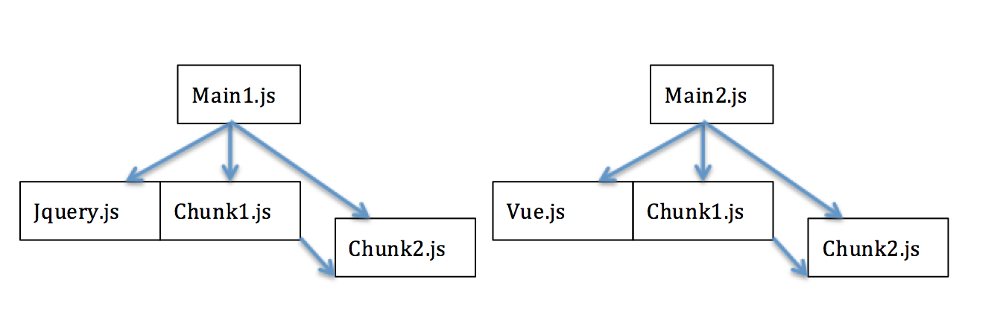

### 1.webpack的基础作用与打包实例
webpack是一个最新的js模块管理器。当webpack处理你的应用的时候，它会递归的创建一个依赖图谱，这个图谱会详细的列出你应用需要的每一个模块，最终将这些模块打包到几个小的输出文件中。当然一般只是一个文件(采用*webpack-common-chunk*插件除外)，最终这个文件将会通过浏览器来加载。这里的核心概念是图谱，我这里在开始webpack的核心概念介绍之前，先给出一个图谱的例子，希望对你下面理解webpack有一定的帮助。

假如，我们有如下的webpack配置:
```js
var CommonsChunkPlugin = require("webpack/lib/optimize/CommonsChunkPlugin");
module.exports = {
    entry: {
        main: process.cwd()+'/example3/main.js',
        main1: process.cwd()+'/example3/main1.js',
        common1:["jquery"],
        common2:["vue"]
    },
    output: {
        path: process.cwd()+'/dest/example3',
        filename: '[name].js'
    },
    plugins: [
        new CommonsChunkPlugin({
            name: ["chunk",'common1','common2'],
            minChunks:2

        })
    ]
};
```
而且各个模块的依赖关系如下图:



此时我们可以看一下上文说到的模块依赖图谱:


在这个图谱中你可以清楚的看到各个模块的依赖关系。如main.js和main1.js的模块id分别为3，2，而且它们的父级模块的id为1，即chunk.js，而chunk.js的父级模块id为0，即common1.js，最后就是我们的common1.js的父级模块的id为4，即我们的common2.js。也就是说，如果我们使用了webpack-common-chunk插件，那么我们会产生多个输出资源文件，而且输出资源的name是通过output.filename配置来指定的。不过有几个注意点你需要了解下:

#### 1.1 webpack-common-chunk抽取公共模块的逻辑
我们上面的例子入口文件的配置是如下形式:
```js
entry: {
        main: process.cwd()+'/example3/main.js',
        main1: process.cwd()+'/example3/main1.js',
        common1:["jquery"],
        common2:["vue"]
    }
```
而且output的配置为:
```js
 output: {
        path: process.cwd()+'/dest/example3',
        filename: '[name].js'
    },
```
此时，我们至少输出4个文件，分别为main.js,main1.js,common1.js,common2.js，但是我们在webpack中又配置了webpack-common-chunk这个插件:
```js
new CommonsChunkPlugin({
            name: ["chunk",'common1','common2'],
            minChunks:2
            //这个配置表示，如果一个模块的依赖次数至少为2次才会被抽取到公共模块中
        })
```
这个插件首先会将main.js和main1.js中出现*两次以上*模块依赖次数的模块单独提取出来，如上图中的chunk1.js和chunk2.js(在main.js和main1.js中都被引用了)，将他们的代码抽取到chunk.js中;然后我们将chunk.js中被依赖两次以上的模块抽取到common1.js中;接着，我们继续将common1.js中被依赖两次以上的代码抽取到common2.js中。最后，我们将会发现:
<pre>
(1)main1.js中只含有jquery.js
(2)main2.js中只含有vue.js
(3)chunk.js中含有main1.js和main2.js的公共模块，即chunk1.js和chunk2.js的内容
(4)common1.js中只含有jquery代码，因为chunk.js中不含有依赖两次以上的模块
(5)common2.js中只含有vue.js代码，因为common1.js中不含有依赖两次以上的模块
</pre>

#### 1.2 模块加载顺序

经过webpack-common-chunk处理后的代码有一点要注意，即抽取层级越高的代码应该越先加载。具体的含义可以通过上面的例子来说明下。比如，上面的common-chunk-plugin的配置如下:
```js
new CommonsChunkPlugin({
            name: ["chunk",'common1','common2'],
            minChunks:2
            //这个配置表示，如果一个模块的依赖次数至少为2次才会被抽取到公共模块中
        })
```
这样我们应该最先加载common2.js，然后是common1.js，chunk.js，最后才是我们的index.js。所以，我们经常可以看到下面的html模板:
```html
<!DOCTYPE html>
<html>
<head>
    <title></title>
</head>
<body>
  <script type="text/javascript" src="common.js"></script>
  <script type="text/javascript" src="index.js"></script>
</body>
</html>
```
之所以是这样，其实很好理解。原因之一在于:我们将下级模块公共的代码已经抽取到其他文件中了，这样，如果我们不预先加载公共模块而先加载其他模块，那么就会出现模块找不到的报错信息。原因之二:假如你去看过我们打包后的[common2.js](https://github.com/liangklfangl/commonsChunkPlugin_Config/blob/master/dest/example3/common2.js#L1)，你可能会看到如下的代码:
```js
/******/ (function(modules) { // webpackBootstrap
/******/    // install a JSONP callback for chunk loading
/******/    var parentJsonpFunction = window["webpackJsonp"];
/******/    window["webpackJsonp"] = function webpackJsonpCallback(chunkIds, moreModules) {
/******/        // add "moreModules" to the modules object,
/******/        // then flag all "chunkIds" as loaded and fire callback
/******/        var moduleId, chunkId, i = 0, callbacks = [];
/******/        for(;i < chunkIds.length; i++) {
/******/            chunkId = chunkIds[i];
/******/            if(installedChunks[chunkId])
/******/                callbacks.push.apply(callbacks, installedChunks[chunkId]);
/******/            installedChunks[chunkId] = 0;
/******/        }
/******/        for(moduleId in moreModules) {
/******/            modules[moduleId] = moreModules[moduleId];
/******/        }
/******/        if(parentJsonpFunction) parentJsonpFunction(chunkIds, moreModules);
/******/        while(callbacks.length)
/******/            callbacks.shift().call(null, __webpack_require__);
/******/        if(moreModules[0]) {
/******/            installedModules[0] = 0;
/******/            return __webpack_require__(0);
/******/        }
/******/    };

/******/    // The module cache
/******/    var installedModules = {};

/******/    // object to store loaded and loading chunks
/******/    // "0" means "already loaded"
/******/    // Array means "loading", array contains callbacks
/******/    var installedChunks = {
/******/        1:0
/******/    };

/******/    // The require function
/******/    function __webpack_require__(moduleId) {

/******/        // Check if module is in cache
/******/        if(installedModules[moduleId])
/******/            return installedModules[moduleId].exports;

/******/        // Create a new module (and put it into the cache)
/******/        var module = installedModules[moduleId] = {
/******/            exports: {},
/******/            id: moduleId,
/******/            loaded: false
/******/        };

/******/        // Execute the module function
/******/        modules[moduleId].call(module.exports, module, module.exports, __webpack_require__);

/******/        // Flag the module as loaded
/******/        module.loaded = true;

/******/        // Return the exports of the module
/******/        return module.exports;
/******/    }

/******/    // This file contains only the entry chunk.
/******/    // The chunk loading function for additional chunks
/******/    __webpack_require__.e = function requireEnsure(chunkId, callback) {
/******/        // "0" is the signal for "already loaded"
/******/        if(installedChunks[chunkId] === 0)
/******/            return callback.call(null, __webpack_require__);

/******/        // an array means "currently loading".
/******/        if(installedChunks[chunkId] !== undefined) {
/******/            installedChunks[chunkId].push(callback);
/******/        } else {
/******/            // start chunk loading
/******/            installedChunks[chunkId] = [callback];
/******/            var head = document.getElementsByTagName('head')[0];
/******/            var script = document.createElement('script');
/******/            script.type = 'text/javascript';
/******/            script.charset = 'utf-8';
/******/            script.async = true;
/******/            script.src = __webpack_require__.p + "" + chunkId + "." + ({"0":"common1","2":"main","3":"main1","4":"chunk"}[chunkId]||chunkId) + ".js";
/******/            head.appendChild(script);
/******/        }
/******/    };

/******/    // expose the modules object (__webpack_modules__)
/******/    __webpack_require__.m = modules;

/******/    // expose the module cache
/******/    __webpack_require__.c = installedModules;

/******/    // __webpack_public_path__
/******/    __webpack_require__.p = "";

/******/    // Load entry module and return exports
/******/    return __webpack_require__(0);
/******/ })
```
最顶级的输出文件中会包含webpack加载其他模块的公共代码，你可以理解为*加载器*,如果不先加载顶级的模块(上面的例子是common2.js)，那么就无法通过它来加载其他的模块，因此也会报错。这里提到的例子代码你可以[点击这里](https://github.com/liangklfangl/commonsChunkPlugin_Config/tree/master/example3)来仔细阅读。

好了，上面讲了一个复杂的例子，如果你不懂也没关系，在webpack常见插件部分我会更加详细的分析。我们下面看看一些webpack的基础概念。

### 2.webpack的基础概念
#### 2.1 webpack的入口文件
上面说过，webpack会构建一个模块的依赖图谱，而构建这个图谱的起点就是我们说的入口文件。webpack相当于从这个起点来绘制类似于上面的整个图谱。通过这个图谱，我们可以知道哪些模块会被打包到最终的文件中，而那些没有出现在图谱中的模块将会被忽略。在webpack中我们使用*entry*这个配置参数来指定我们的webpack入口文件，比如我们上面的例子:
```js
 entry: {
        main: process.cwd()+'/example3/main.js',
        main1: process.cwd()+'/example3/main1.js',
        common1:["jquery"],
        common2:["vue"]
    }
```
这也就是告诉我们，我们的入口文件总共是4个，那么我们最终会构建出四个不同的文件依赖图谱。当然，这种配置常用于单页面应用，一般只有一个入口文件。这个配置可以允许我们使用CommonChunkPlugin,然后将那些公共的模块抽取到vendor.js(名字可以自定义)中。这种形式，通过上面的例子你应该已经了解到了。

当然，上面这种配置依然可以应用于*多页面*应用，比如下面的例子：
```js
const config = {
  entry: {
    pageOne: './src/pageOne/index.js',
    pageTwo: './src/pageTwo/index.js',
    pageThree: './src/pageThree/index.js'
  }
};
```
我们告诉webpack需要三个不同的依赖图谱。因为在多页面应用中，当你访问一个URL的时候，实际上你需要的是一个html文档，我们只需要将打包后的资源插入到你的html文档中就可以了。比如上面的配置，我们需要分别读取pageOne，pageTwo，pageThree下的index.js作为入口文件，然后结合我们的html模板打包一次，并将打包后的html以及输出资源结合起来输出到特定的文件路径下，这样当我们访问固定的html的时候就可以了。因此，webpack的单页面打包和多页面的打包其实原理是完全一致的。

#### 2.2 webpack的output常见配置
##### 2.2.1 output.path
当我们的资源打包后，我们需要指定特定的输出路径，这就是output需要完成的事情。此时，我们可以通过output配置来完成,比如我们上面的例子:
```js
entry: {
        main: process.cwd()+'/example3/main.js',
        main1: process.cwd()+'/example3/main1.js',
        common1:["jquery"],
        common2:["vue"]
    },
    output: {
        path: process.cwd()+'/dest/example3',
        filename: '[name].js'
    },
```
我们指定了输出路径为*process.cwd()+'/dest/example3'*，相当于告诉webpack所有的输出文件全部放到这个目录下。

##### 2.2.2 output.filename
上面的文件名称我们指定为*'[name].js'*，其中[name]和entry中的key保持一致。其中filename的配置还是比较多的，不仅可以使用name，还可以使用id,hash,chunkhash等。
<pre>
[name]：这个模块的名称，就是entry中指定的key
[id]：这个模块的id，由webpack来分配，通过上面的依赖图谱你可以看到
[hash]：每次webpack完成一个打包都会生成这个hash
[chunkhash]：webpack每生成一个文件就叫一个chunk，这个chunk本身的hash
</pre>
其中这里的hash如果不懂，可以查看[webpack-dev-server](https://github.com/liangklfangl/webpack-dev-server)的"深入源码分析"部分，这里有详细的论述。

##### 2.2.3 publichPath与output.path
打包好的bundle在被请求的时候，其路径是相对于你配置的`publicPath`来说的。因为我理解的publicPath相当于虚拟路径，其映射于你指定的`output.path`。假如你指定的publicPath为 "/assets/",而且output.path为"build",那么相当于虚拟路径"/assets/"对应于"build"(前者和后者指向的是同一个位置)，而如果build下有一个"index.css"，那么通过虚拟路径访问就是`/assets/index.css`。比如我们有一个如下的配置:
```js
module.exports = {
  entry: {
    app: ["./app/main.js"]
  },
  output: {
    path: path.resolve(__dirname, "build"),
    publicPath: "/assets/",
    //此时相当于/assets/路径对应于build目录，是一个映射的关系
    filename: "bundle.js"
  }
}
```
那么我们要访问编译后的资源可以通过localhost:8080/assets/bundle.js来访问。如果我们在build目录下有一个html文件，那么我们可以使用下面的方式来访问js资源
```html
<!DOCTYPE html>
<html lang="en">
<head>
  <meta charset="UTF-8">
  <title>Document</title>
</head>
<body>
  <script src="assets/bundle.js"></script>
</body>
</html>
```
##### 2.2.4 hotUpdateChunkFilename vs hotUpdateMainFilename
我这里提供了一个[例子](https://github.com/liangklfangl/wcf),当你修改了test目录下的文件的时候，比如修改了scss文件，此时你会发现在页面中多出了一个script元素，内容如下：
```html
<script type="text/javascript" charset="utf-8" src="0.188304c98f697ecd01b3.hot-update.js"></script>
```
当你打开它你会看到：
```js
webpackHotUpdate(0,{
/***/ 15:
/***/ (function(module, exports, __webpack_require__) {
exports = module.exports = __webpack_require__(46)();
// imports
// module
exports.push([module.i, "html {\n  border: 1px solid yellow;\n  background-color: pink; }\n\nbody {\n  background-color: lightgray;\n  color: black; }\n  body div {\n    font-weight: bold; }\n    body div span {\n      font-weight: normal; }\n", ""]);
// exports

/***/ })
})
//# sourceMappingURL=0.188304c98f697ecd01b3.hot-update.js.map
```
从内容你也可以看出，只是将我们修改的模块push到exports对象中！而hotUpdateChunkFilename就是为了让你能够执行script的src中的值！而同样的hotUpdateMainFilename是一个json文件用于指定哪些模块发生了变化，在output目录下。

##### 2.2.5 externals vs libraryTarget vs library
假如我们需要完成下面的两个需求：
<pre>
1.我们的模块依赖于jQuery，但是我们不希望jQuery打包到最后的文件中去
2.我们的模块要存在于全局的变量Foo上面
</pre>
那么我们需要将webpack配置如下：
```js
module.exports = {
  entry: 
  {
    main:process.cwd()+'/example1/main.js',
  },
  output: {
    path:process.cwd()+'/dest/example1',
    filename: '[name].js',
    // export itself to a global var
    libraryTarget: "var",
    // name of the global var: "Foo"
    library: "Foo"
  },
    externals: {
        // require("jquery") is external and available
        //  on the global var jQuery
        "jquery": "jQuery"
    },
  plugins: [
   new CommonsChunkPlugin({
       name:"chunk",
       minChunks:2
   }),
    new  HtmlWebpackPlugin()
  ]
};
```
其中external配置表示我们的模块中的require('jquery')中的jquery来自于window.jQuery，也就是来自于全局对象jQuery，而不要单独打包到我们的入口文件的bundle中，在页面中我们通过script标签来引入！
```js
 externals: {
        // require("jquery") is external and available
        //  on the global var jQuery
        "jquery": "jQuery"
    }
```
下面我们详细的分析下libraryTarget和library相关内容
<pre>
library:在output中配置，可以指定你的库的名称
libraryTarget:指定你的模块输出类型，可以是commonjs,AMD,script形式,UMD模式
</pre>
例子1：其中我们的libraryTarget设置为var,而library设置为'Foo'。也就是表示我们把入口文件打包的结果封装到变量Foo上面(以下例子的external全部是一样的，见上面的webpack.config.js文件)
```js
output: {
    path:process.cwd()+'/dest/example1',
    filename: '[name].js',
    // export itself to a global var
    libraryTarget: "var",
    // name of the global var: "Foo"
    library: "Foo"
  }
```
我们看看打包的结果：
```js
var Foo =
webpackJsonpFoo([0,1],[
/* 0 */
/***/ function(module, exports, __webpack_require__) {
  var jQuery = __webpack_require__(1);
  var math = __webpack_require__(2);
  function Foo() {}
  // ...
  module.exports = Foo;
/***/ },
/* 1 */
/***/ function(module, exports) {
       module.exports = jQuery
/***/ },
/* 2 */
/***/ function(module, exports) {

       console.log('main1');

/***/ }
]);
```
从结果分析我们的目的，我们的入口文件的bunle被打包成为一个变量，变量名就是library指定的Foo。而且我们externals中指定的jQuery也被打包成为一个模块，但是这个模块是没有jQuery源码的，他的模块内容很简单，就是引用window.jQuery：
```js
/* 1 */
/***/ function(module, exports) {
       module.exports = jQuery;
/***/ },
```
关于externals vs libraryTarget vs library还有不懂的地方可以仔细阅读我写的[webpack中的externals vs libraryTarget vs library深入分析](https://github.com/liangklfangl/webpack-external-library)文章。

#### 2.3 webpack的Loader
因为浏览器并非能够识别所有的文件类型(比如scss/less/typescript)，因此在浏览器加载特定类型的资源之前我们需要对资源本身进行处理。webpack将所有的文件类型都当做一个模块，比如css,html,scss,jpg等，但是webpack本身只能识别javascript文件。因此，我们需要特定的loader将我们的文件转化为javascript模块，同时将这个模块添加到依赖图谱中。

webpack中loader具有如下的作用:
<pre>
1.识别特定的文件类型应该被那个loader处理
2.转化特定的文件以便将它添加到依赖图谱中，并最终添加到打包后的输出文件中
</pre>
我们下面给出一个例子:
```js
const path = require('path');
const config = {
  entry: './path/to/my/entry/file.js',
  output: {
    path: path.resolve(__dirname, 'dist'),
    filename: 'my-first-webpack.bundle.js'
  },
  module: {
    rules: [
      { test: /\.txt$/, use: 'raw-loader' }
    ]
  }
};

module.exports = config;
```
上面这个例子相当于告诉webpack，当你遇到*require()/import*一个后缀名为*txt*的文件的时候就要使用raw-loader来处理，但是你必须保证在node_modules中已经安装了这个raw-loader，否则报错。而且，在文件路径嵌套很深的情况下，建议使用如下方式:
```js
 rules: [
      { test: /\.txt$/, use: require.resolve('raw-loader') }
    ]
```
否则可能即使安装了也找不到相应的loader，特别是当npm3出现以后。

#### 2.4 webpack的Plugin
上面我们说的loader是在特定文件类型的基础上完成它的处理的，即它是针对于特定的文件类型，并把它转化为javascript中的模块。而我们的*plugin*用于在编译和打包过程中对所有的模块执行特定的操作。而且我们的webpack插件系统是非常强大的和可配置的。

为了使用插件，你只需要*require*它并把它添加到配置文件的*plugins*数组中。比如下面的例子:
```js
 plugins: [
    //注意：这里使用了webpack-common-chunk，所以会产生两个文件，即common.js和index.js(名字自由设置)
        new CommonsChunkPlugin({
            name: ["chunk",'common1','common2'],
            minChunks:2

        })
    ]
```

### 3.本章小结
该本章节中，我们通过一个CommonChunkPlugin的例子引入了打包后*模块图谱*的概念，并对CommonChunkPlugin的打包原理进行了分析。同时，我们介绍了webpack中四大核心概念，即入口文件，输出文件，Loader，Plugin等，并对输出文件中很多容易混淆的概念进行了深入的讲解。通过本章节，你对webpack本身应该会有一个初略的了解，后续我们会针对Loader,Plugin等核心内容进行进一步的剖析。
