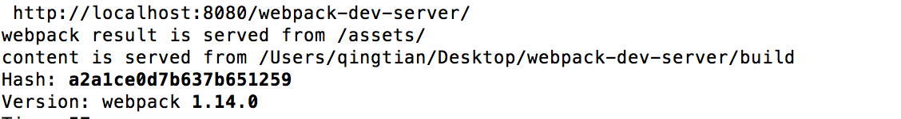
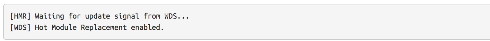

### 1.本章概述
在这个章节，主要会讲解一些webpack与webpack-dev-server结合的内容。包括webpack-dev-server中一些常见的容易混淆的知识点，以及webpack-dev-server一些原理性相关的东西。
### 2.webpack-dev-server核心概念
#### 2.1 webpack的ContentBase vs publicPath vs output.path
webpack-dev-server会使用当前的路径作为请求的资源路径(所谓`当前的路径`就是你运行webpack-dev-server这个命令的路径，如果你对webpack-dev-server进行了包装，比如[wcf](https://github.com/liangklfangl/wcf),那么当前路径指的就是运行wcf命令的路径,一般是项目的根路径)，但是你可以通过指定content base来修改这个默认行为:
```js
webpack-dev-server --content-base build/
```
这样webpack-dev-server就会使用`build目录`下的资源来处理静态资源的请求，比如`css/图片等`。content-base一般不要和publicPath,output.path混淆掉。其中content-base表示`静态资源`的路径是什么,比如下面的例子:
```html
<!DOCTYPE html>
<html>
<head>
  <title></title>
  <link rel="stylesheet" type="text/css" href="index.css">
</head>
<body>
  <div id="react-content">这里要插入js内容</div>
</body>
</html>
```
在作为html-webpack-plugin的template以后，那么上面的`index.css`路径到底是什么?是相对于谁来说?上面我已经强调了:如果在没有指定content-base的情况下就是相对于`当前路径`来说的，所谓的当前路径就是在运行webpack-dev-server目录来说的，所以假如你在项目根路径运行了这个命令，那么你就要保证在项目根路径下存在该index.css资源，否则就会存在html-webpack-plugin的404报错。当然，为了解决这个问题，你可以将content-base修改为和html-webpack-plugin的html模板一样的目录。

上面讲到content-base只是和静态资源的请求有关，那么我们将其和`publicPath`和`output.path`做一个区分:

首先:假如你将output.path设置为`build`(这里的build和content-base的build没有任何关系，请不要混淆),你要知道webpack-dev-server实际上并没有将这些打包好的bundle写到这个目录下，而是存在于内存中的，但是我们可以`假设`(注意这里是假设)其是写到这个目录下的

然后：这些打包好的bundle在被请求的时候，其路径是相对于你配置的`publicPath`来说的，我的理解publicPath相当于虚拟路径，其映射于你指定的`output.path`。假如你指定的publicPath为 "/assets/",而且output.path为"build",那么相当于虚拟路径"/assets/"对应于"build"(前者和后者指向的是同一个位置)，而如果build下有一个"index.css"，那么通过虚拟路径访问就是`/assets/index.css`。

最后:如果某一个内存路径(文件写在内存中)已经存在特定的bundle，而且编译后内存中有新的资源，那么我们也会使用新的内存中的资源来处理该请求，而不是使用旧的bundle!比如我们有一个如下的配置:
```js
module.exports = {
  entry: {
    app: ["./app/main.js"]
  },
  output: {
    path: path.resolve(__dirname, "build"),
    publicPath: "/assets/",
    //此时相当于/assets/路径对应于build目录，是一个映射的关系
    filename: "bundle.js"
  }
}
```

那么我们要访问编译后的资源可以通过localhost:8080/assets/bundle.js来访问。如果我们在build目录下有一个html文件，那么我们可以使用下面的方式来访问js资源

```html
<!DOCTYPE html>
<html lang="en">
<head>
  <meta charset="UTF-8">
  <title>Document</title>
</head>
<body>
  <script src="assets/bundle.js"></script>
</body>
</html>
```

此时你会看到控制台输出如下内容:



主要关注下面两句输出:
<pre>
Webpack result is served from /assets/
Content is served from /users/…./build
</pre>
之所以是这样的输出结果是因为我们设置了contentBase为build,因为我们运行的命令为`webpack-dev-server --content-base build/`。所以，一般情况下：如果在html模板中不存在对外部相对资源的引用,我们并不需要指定content-base，但是如果存在对外部相对资源css/图片的引用，我们可以通过指定content-base来设置默认静态资源加载的路径，除非你所有的静态资源全部在`当前目录下`。

#### 2.2 webpack-dev-server热加载(HMR)
为我们的webpack-dev-server开启HMR模式只需要在命令行中添加--hot，他会将HotModuleReplacementPlugin这个插件添加到webpack的配置中去，所以开启HotModuleReplacementPlugin最简单的方式就是使用inline模式。在inline模式下，你只需要在命令行中添加--inline  --hot就可以自动实现。这时候webpack-dev-server就会自动添加webpack/hot/dev-server入口文件到你的配置中去，你只是需要访问下面的路径就可以了http://«host»:«port»/«path»。在控制台中你可以看到如下的内容：



其中以[HMR]开头的部分来自于webpack/hot/dev-server模块，而`以[WDS]开头的部分来自于webpack-dev-server的客户端`。下面的部分来自于webpack-dev-server/client/index.js内容，其中的log都是以[WDS]开头的:

```js
function reloadApp() {
  if(hot) {
    log("info", "[WDS] App hot update...");
    window.postMessage("webpackHotUpdate" + currentHash, "*");
  } else {
    log("info", "[WDS] App updated. Reloading...");
    window.location.reload();
  }
}
```
而在我们的webpack/hot/dev-server中的log都是以[HMR]开头的(他是来自于webpack本身的一个plugin):
```js
if(!updatedModules) {
        console.warn("[HMR] Cannot find update. Need to do a full reload!");
        console.warn("[HMR] (Probably because of restarting the webpack-dev-server)");
        window.location.reload();
        return;
      }
```
那么我们如何在nodejs中使用HMR功能呢？此时需要修改三处配置文件：
<pre>
第一：添加一个webpack的入口点，也就是webpack/hot/dev-server
第二：添加一个new webpack.HotModuleReplacementPlugin()到webpack的配置中
第三：添加hot:true到webpack-dev-server配置中，从而在服务端启动HMR(可以在cli中使用webpack-dev-server --hot)
</pre>
比如下面的代码就展示了webpack-dev-server为了实现HMR是如何处理我们的入口文件的。
```js
if(options.inline) {
  var devClient = [require.resolve("../client/") + "?" + protocol + "://" + (options.public || (options.host + ":" + options.port))];
  //将webpack-dev-server的客户端入口添加到的bundle中，从而达到自动刷新
  if(options.hot)
    devClient.push("webpack/hot/dev-server");
    //这里是webpack-dev-server中对hot配置的处理
  [].concat(wpOpt).forEach(function(wpOpt) {
    if(typeof wpOpt.entry === "object" && !Array.isArray(wpOpt.entry)) {
      Object.keys(wpOpt.entry).forEach(function(key) {
        wpOpt.entry[key] = devClient.concat(wpOpt.entry[key]);
      });
    } else {
      wpOpt.entry = devClient.concat(wpOpt.entry);
    }
  });
}
```
满足上面三个条件的nodejs使用方式如下:
```js
var config = require("./webpack.config.js");
config.entry.app.unshift("webpack-dev-server/client?http://localhost:8080/", "webpack/hot/dev-server");
//条件一(添加了webpack-dev-server的客户端和HMR的服务端)
var compiler = webpack(config);
var server = new webpackDevServer(compiler, {
  hot: true //条件二(--hot配置，webpack-dev-server会自动添加HotModuleReplacementPlugin),条件三
  ...
});
server.listen(8080);
```
#### 2.3 webpack-dev-server启动proxy代理
webpack-dev-server使用[http-proxy-middleware](https://github.com/chimurai/http-proxy-middleware)去把请求代理到一个外部的服务器，配置的样例如下：
```js
proxy: {
  '/api': {
    target: 'https://other-server.example.com',
    secure: false
  }
}
// In webpack.config.js
{
  devServer: {
    proxy: {
      '/api': {
        target: 'https://other-server.example.com',
        secure: false
      }
    }
  }
}
// Multiple entry
proxy: [
  {
    context: ['/api-v1/**', '/api-v2/**'],
    target: 'https://other-server.example.com',
    secure: false
  }
]
```
这种代理在很多情况下是很重要的，比如你可以把一些静态文件通过本地的服务器加载，而一些API请求全部通过一个远程的服务器来完成。还有一个情景就是在两个独立的服务器之间进行请求分割，如一个服务器负责授权而另外一个服务器负责应用本身。下面我给出日常开发中遇到的一个例子:

(1)我有一个请求是通过相对路径来完成的，比如地址是"/msg/show.htm"。但是，在日常和生产环境下前面会加上不同的域名，比如日常是you.test.com而生产环境是you.inc.com。

(2)那么比如我现在想在本地启动一个webpack-dev-server,然后通过webpack-dev-server来访问日常的服务器，而且日常的服务器地址是11.160.119.131，所以我就会通过如下的配置来完成:
```js
devServer: {
    port: 8000,
    proxy: {
      "/msg/show.htm": {
        target: "http://11.160.119.131/",
        secure: false
      }
    }
  }
```
此时当你请求"/msg/show.htm"的时候，其实请求的真是URL地址为"http"//11.160.119.131/msg/show.htm"。

(3)在开发环境中遇到一个问题，那就是:如果我本地的devServer启动的地址为:"http://30.11.160.255:8000/" 或者常见的"http://0.0.0.0:8000/" ，那么真实的服务器会返回一个URL要求我登录，但是，将你的本地devServer启动到localhost上就不存在这个问题了(一个可能的原因在于localhost种上了后端需要的cookie，而其他的域名没有种上cookie，导致代理服务器访问日常服务器的时候没有相应的cookie，从而要求权限验证)。其中指定localhost的方式你可以通过[wcf](https://github.com/liangklfangl/wcf)来完成，因为wcf默认可以支持ip或者localhost方式来访问。当然你也可以通过添加下面的代码来完成:
```js
devServer: {
    port: 8000,
    host:'localhost',
    proxy: {
      "/msg/show.htm": {
        target: "http://11.160.119.131/",
        secure: false
      }
    }
  }
```

(4)我想在此说一下webpack-dev-server的原理是什么？你可以通过查看这个[反向代理为何叫反向代理？](https://www.zhihu.com/question/24723688)这个文章来了解基础知识。其实正向代理和反向代理用一句话来概括就是:"正向代理隐藏了真实的客户端，而反向代理隐藏了真实的服务器"。而我们的webpack-dev-server其实扮演了一个代理服务器的角色，服务器之间通信不会存在前端常见的同源策略，这样当你请求我们的webpack-dev-server的时候，他会从真实的服务器中请求数据，然后将数据发送给你的浏览器。
<pre>
  (1)browser => localhost:8080(webpack-dev-server无代理) => http://you.test.com
  (2)browser => localhost:8080(webpack-dev-server有代理) => http://you.test.com
</pre>
上面的第一种情况就是没有代理的情况，在我们的localhost:8080的页面通过前端策略去访问http://you.test.com 会存在同源策略，即第二步是通过前端策略去访问另外一个地址的。但是对于第二种情况，我们的第二步其实是通过代理去完成的，即服务器之间的通信，不存在同源策略问题。而我们变成了直接访问代理服务器，代理服务器返回一个页面，对于*页面中*某些满足特定条件前端请求(proxy,rewrite配置)全部由代理服务器来完成，这样同源问题就通过代理服务器的方式得到了解决。

(5)上面讲述的是target是ip的情况，如果target要指定为域名的方式，可能需要绑定host。比如下面是我绑定的host:
```js
11.160.119.131 youku.min.com
```
那么我下面的proxy配置就可以采用域名了:
```js
devServer: {
    port: 8000,
    proxy: {
      "/msg/show.htm": {
        target: "http://youku.min.com/",
        secure: false
      }
    }
  }
```
这和target绑定为IP地址的效果是完全一致的。总结一句话:"target指定了满足特定URL的请求应该对应到哪台主机上，即代理服务器应该访问的真实主机地址"。

其实proxy还可以通过配置一个*bypass*函数的返回值视情况绕开一个代理。这个函数可以查看http请求和响应以及一些代理的选项。它返回要么是false要么是一个URL的path，这个path将会用于处理请求而不是使用原来代理的方式完成。下面例子的配置将会忽略来自于浏览器的HTTP请求，他和historyApiFallback配置类似。浏览器请求可以像往常一样接收到HTML文件，但是API请求将会被代理到另外的服务器：
```js
proxy: {
  '/some/path': {
    target: 'https://other-server.example.com',
    secure: false,
    bypass: function(req, res, proxyOptions) {
      if (req.headers.accept.indexOf('html') !== -1) {
        console.log('Skipping proxy for browser request.');
        return '/index.html';
    }
  }
 }
}
```
对于代理的请求也可以通过提供一个函数来重写，这个函数可以查看或者改变http请求。下面的例子就会重写HTTP请求，其主要作用就是移除URL前面的/api部分。
```js
proxy: {
  '/api': {
    target: 'https://other-server.example.com',
    pathRewrite: {'^/api' : ''}
  }
}
```
其中pathRewrite配置来自于http-proxy-middleware。更多配置你可以查看[http-proxy-middleware官方文档](https://github.com/chimurai/http-proxy-middleware)
#### 2.4 historyApiFallback选项
当你使用HTML5的history API的时候，当404出现的时候你可能希望使用index.html来作为请求的资源，这时候你可以使用这个配置:historyApiFallback:true。然而，如果你修改了output.publicPath，你就需要指定重定向的URL，你可以使用historyApiFallback.index选项。

```js
// output.publicPath: '/foo-app/'
historyApiFallback: {
  index: '/foo-app/'
}
```

使用rewrite选项你可以重新设置静态资源

```js
historyApiFallback: {
    rewrites: [
        // shows views/landing.html as the landing page
        { from: /^\/$/, to: '/views/landing.html' },
        // shows views/subpage.html for all routes starting with /subpage
        { from: /^\/subpage/, to: '/views/subpage.html' },
        // shows views/404.html on all other pages
        { from: /./, to: '/views/404.html' },
    ],
},
```
使用disableDotRule来满足一个需求，即如果一个资源请求包含一个`.`符号,那么表示是对某一个特定资源的请求，也就满足dotRule。我们看看[connect-history-api-fallback](https://github.com/liangklfang/connect-history-api-fallback)内部是如何处理的：
```js
 if (parsedUrl.pathname.indexOf('.') !== -1 &&
        options.disableDotRule !== true) {
      logger(
        'Not rewriting',
        req.method,
        req.url,
        'because the path includes a dot (.) character.'
      );
      return next();
    }
    rewriteTarget = options.index || '/index.html';
    logger('Rewriting', req.method, req.url, 'to', rewriteTarget);
    req.url = rewriteTarget;
    next();
  };
```
也就是说，如果是对绝对资源的请求，也就是满足dotRule,但是disableDotRule(disable dot rule file request)为false,表示我们会自己对满足dotRule的资源进行处理，所以不用定向到index.html中!如果disableDotRule为true表示我们不会对满足dotRule的资源进行处理，所以直接定向到index.html!
```js
history({
  disableDotRule: true
})
```

#### 2.5 webpack-dev-server更多配置
更多配置的内容请查看下面的注释，我只会重点讲解filename和lazy配置：
```js
var server = new WebpackDevServer(compiler, {
  contentBase: "/path/to/directory",
  //content-base配置 
  hot: true,
  //开启HMR，由webpack-dev-server发送"webpackHotUpdate"消息到客户端代码
  historyApiFallback: false,
  //单页应用404转向index.html
  compress: true,
  //开启资源的gzip压缩
  proxy: {
    "**": "http://localhost:9090"
  },
  //代理配置，来源于http-proxy-middleware
  setup: function(app) {
     //webpack-dev-server本身是Express服务器你可以添加自己的路由
    // app.get('/some/path', function(req, res) {
    //   res.json({ custom: 'response' });
    // });
  },
  //为Express服务器的express.static方法配置参数http://expressjs.com/en/4x/api.html#express.static
  staticOptions: {
  },
  //在inline模式下用于控制在浏览器中打印的log级别，如`error`, `warning`, `info` or `none`.
  clientLogLevel: "info",
  //不在控制台打印任何log
  quiet: false,
  //不输出启动log
  noInfo: false,
  //webpack不监听文件的变化，每次请求来的时候重新编译
  lazy: true,
  //文件名称
  filename: "bundle.js",
  //webpack的watch配置，每隔多少秒检查文件的变化
  watchOptions: {
    aggregateTimeout: 300,
    poll: 1000
  },
  //output.path的虚拟路径映射
  publicPath: "/assets/",
  //设置自定义http头
  headers: { "X-Custom-Header": "yes" },
  //打包状态信息输出配置
  stats: { colors: true },
  //配置https需要的证书等
  https: {
    cert: fs.readFileSync("path-to-cert-file.pem"),
    key: fs.readFileSync("path-to-key-file.pem"),
    cacert: fs.readFileSync("path-to-cacert-file.pem")
  }
});
server.listen(8080, "localhost", function() {});
// server.close();
```
上面其他配置中，除了filename和lazy外都是容易理解的，那么我们下面继续分析下*lazy*和*filename*的具体使用场景。我们知道，在lazy阶段webpack-dev-server不是调用compiler.watch方法，而是等待请求到来的时候我们才会编译。源代码如下:
```js
startWatch: function() {
      var options = context.options;
      var compiler = context.compiler;
      // start watching
      if(!options.lazy) {
        var watching = compiler.watch(options.watchOptions, share.handleCompilerCallback);
        context.watching = watching;
        //context.watching得到原样返回的Watching对象
      } else {
       //如果是lazy，表示我们不是watching监听，而是请求的时候才编译
        context.state = true;
      }
    }
```
调用rebuild的时候会判断context.state。每次重新编译后在compiler.done中会将context.state重置为true!
```js
rebuild: function rebuild() {
      //如果没有通过compiler.done产生过Stats对象，那么我们设置forceRebuild为true
      //如果已经有Stats表明以前build过，那么我们调用run方法
      if(context.state) {
        context.state = false;
        //lazy状态下context.state为true，重新rebuild
        context.compiler.run(share.handleCompilerCallback);
      } else {
        context.forceRebuild = true;
      }
    },
```
下面是当请求到来的时候我们调用上面的rebuild继续重新编译：
```js
  handleRequest: function(filename, processRequest, req) {
      // in lazy mode, rebuild on bundle request
      if(context.options.lazy && (!context.options.filename || context.options.filename.test(filename)))
        share.rebuild();
      //如果filename里面有hash，那么我们通过fs从内存中读取文件名，同时回调就是直接发送消息到客户端!!!
      if(HASH_REGEXP.test(filename)) {
        try {
          if(context.fs.statSync(filename).isFile()) {
            processRequest();
            return;
          }
        } catch(e) {
        }
      }
      share.ready(processRequest, req);
      //回调函数将文件结果发送到客户端
    },
```
其中processRequest就是直接把编译好的资源发送到客户端:
```js
function processRequest() {
      try {
        var stat = context.fs.statSync(filename);
        //获取文件名
        if(!stat.isFile()) {
          if(stat.isDirectory()) {
            filename = pathJoin(filename, context.options.index || "index.html");
            //文件名
            stat = context.fs.statSync(filename);
            if(!stat.isFile()) throw "next";
          } else {
            throw "next";
          }
        }
      } catch(e) {
        return goNext();
      }
      // server content
      // 直接访问的是文件那么读取，如果是文件夹那么要访问文件夹
      var content = context.fs.readFileSync(filename);
      content = shared.handleRangeHeaders(content, req, res);
      res.setHeader("Access-Control-Allow-Origin", "*"); 
      // To support XHR, etc.
      res.setHeader("Content-Type", mime.lookup(filename) + "; charset=UTF-8");
      res.setHeader("Content-Length", content.length);
      if(context.options.headers) {
        for(var name in context.options.headers) {
          res.setHeader(name, context.options.headers[name]);
        }
      }
      // Express automatically sets the statusCode to 200, but not all servers do (Koa).
      res.statusCode = res.statusCode || 200;
      if(res.send) res.send(content);
      else res.end(content);
    }
  }

```
所以，在lazy模式下如果我们没有指定文件名filename，即每次请求的是那个webpack输出文件(chunk)，那么我们每次都是会重新rebuild的！但是如果指定了文件名，那么只有访问该文件名的时候才会rebuild!

### 3.本章小结
该本章节中，我们深入讲解了webpack-dev-server中一些核心的概念，如contentBase,publicPath,proxy代理，historyApiFallback,lazyLoad等。通过这个章节，你对于webpack-dev-server应该有了一个深入的认识，即webpack-dev-server本身只是一个Express服务器，只是他将资源请求与webpack的打包过程联系起来。
