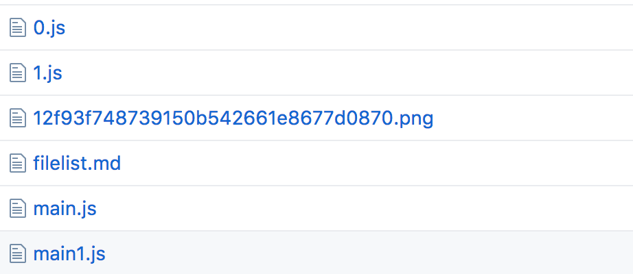

##### 本章概述
在本章节我会首先通过具体的实例向你展示我们的compilation对象具有的常用属性，并告诉你这些属性具体的含义。其中包含chunks，assets,modules等等。最后，我会深入的分析compiler和compilation对象具有的各种钩子方法。通过本章节的学习，你将会了解webpack中module,chunk等重要的概念，并对webpack打包过程有一个宏观的把握。

##### 1.webpack的compilation常用内容
##### 1.1 chunk的内容
为了更好的理解下面的概念，我先给大家看看webpack中所谓的chunk都包含哪些内部属性，希望能对大家理解chunk有一定的帮助，下面展示的就是一个chunk的实例。
```js
compilation.getStats().toJson().chunks
//获取compilation所有的chunks:
```
chunks所有的内容如下：
```js
[ { id: 0,
   //chunk id
    rendered: true,
    //https://github.com/liangklfangl/commonchunkplugin-source-code
    initial: false,
    //require.ensure产生的chunk,非initial
    //initial表示是否是在页面初始化就需要加载的模块，而不是按需加载的模块
    entry: false,
    //是否含有webpack的runtime环境,通过CommonChunkPlugin处理后，runtime环境被提到最高层级的chunk
    recorded: undefined,
    extraAsync: false,
    size: 296855,
    //chunk大小，比特
    names: [],
    //require.ensure不是通过webpack配置的，所以chunk的names是空
    files: [ '0.bundle.js' ],
    //该chunk产生的输出文件,即输出到特定文件路径下的文件名称
    hash: '42fbfbea594ba593e76a',
    //chunk的hash,即chunkHash
    parents: [ 2 ],
    //父级chunk的id值
    origins: [ [Object] ] 
    //该chunk是如何产生的
    },
  { id: 1,
    rendered: true,
    initial: false,
    entry: false,
    recorded: undefined,
    extraAsync: false,
    size: 297181,
    names: [],
    files: [ '1.bundle.js' ],
    hash: '456d05301e4adca16986',
    parents: [ 2 ],
    origins: [ [Object] ] },
  { id: 2,
    rendered: true,
    initial: true,
    entry: false,
    recorded: undefined,
    extraAsync: false,
    size: 687,
    names: [ 'main' ],
    files: [ 'bundle.js' ],
    hash: '248029a0cfd99f46babc',
    parents: [ 3 ],
    origins: [ [Object] ] },
  { id: 3,
    rendered: true,
    initial: true,
    entry: true,
    recorded: undefined,
    extraAsync: false,
    size: 0,
    names: [ 'vendor' ],
    files: [ 'vendor.bundle.js' ],
    hash: 'fbf76c7c330eaf0de943',
    parents: [],
    origins: [] } ]
```
而上面的每一个chunk还有一个origins参数，其含有的内容如下,它描述了某一个chunk是如何产生的：
```js
{
  "loc": "", // Lines of code that generated this chunk
  "module": "(webpack)\\test\\browsertest\\lib\\index.web.js", // Path to the module
  "moduleId": 0, // The ID of the module
  "moduleIdentifier": "(webpack)\\test\\browsertest\\lib\\index.web.js", // Path to the module
  "moduleName": "./lib/index.web.js", // Relative path to the module
  "name": "main", // The name of the chunk
  "reasons": [
    // A list of the same `reasons` found in module objects
  ]
}
```
如果对于chunk中某些属性不懂的，可以点击我这里对于[webpack-common-chunk-plugin的分析](https://github.com/liangklfangl/commonchunkplugin-source-code)。下面是给出的几个关于chunks的例子：

例1：html-webpack-plugin中就使用到了多个chunks属性,如names,initial等
```js
//该chunk要被选中的条件是：有名称，不是懒加载，在includedChunks中但是不在excludedChunks中
HtmlWebpackPlugin.prototype.filterChunks = function (chunks, includedChunks, excludedChunks) {
  return chunks.filter(function (chunk) {
    var chunkName = chunk.names[0];
    // This chunk doesn't have a name. This script can't handled it.
    //通过require.ensure产生的chunk不会被保留，names是一个数组
    if (chunkName === undefined) {
      return false;
    }
    // Skip if the chunk should be lazy loaded
    //如果是require.ensure产生的chunk直接忽略
    if (!chunk.initial) {
      return false;
    }
    // Skip if the chunks should be filtered and the given chunk was not added explicity
    //这个chunk必须在includedchunks里面
    if (Array.isArray(includedChunks) && includedChunks.indexOf(chunkName) === -1) {
      return false;
    }
    // Skip if the chunks should be filtered and the given chunk was excluded explicity
    //这个chunk不能在excludedChunks中
    if (Array.isArray(excludedChunks) && excludedChunks.indexOf(chunkName) !== -1) {
      return false;
    }
    // Add otherwise
    return true;
  });
};
```

例2：通过id对chunks进行排序

```js
/**
 * Sorts the chunks based on the chunk id.
 *
 * @param  {Array} chunks the list of chunks to sort
 * @return {Array} The sorted list of chunks
 * entry chunk在前，两个都是entry那么id大的在前
 */
module.exports.id = function (chunks) {
  return chunks.sort(function orderEntryLast (a, b) {
    if (a.entry !== b.entry) {
      return b.entry ? 1 : -1;
    } else {
      return b.id - a.id;
    }
  });
};
```

例3:通过chunk.parents(全部是parentId数组)来获取拓排序
```js
/*
  Sorts dependencies between chunks by their "parents" attribute.
  This function sorts chunks based on their dependencies with each other.
  The parent relation between chunks as generated by Webpack for each chunk
  is used to define a directed (and hopefully acyclic) graph, which is then
  topologically sorted in order to retrieve the correct order in which
  chunks need to be embedded into HTML. A directed edge in this graph is
  describing a "is parent of" relationship from a chunk to another (distinct)
  chunk. Thus topological sorting orders chunks from bottom-layer chunks to
  highest level chunks that use the lower-level chunks.

  @param {Array} chunks an array of chunks as generated by the html-webpack-plugin.
  It is assumed that each entry contains at least the properties "id"
  (containing the chunk id) and "parents" (array containing the ids of the
  parent chunks).
  @return {Array} A topologically sorted version of the input chunks
  因为最上面的通过commonchunkplugin产生的chunk具有webpack的runtime，所以排列在前面
*/
module.exports.dependency = function (chunks) {
  if (!chunks) {
    return chunks;
  }
  // We build a map (chunk-id -> chunk) for faster access during graph building.
  // 通过chunk-id -> chunk这种Map结构更加容易绘制图
  var nodeMap = {};
  chunks.forEach(function (chunk) {
    nodeMap[chunk.id] = chunk;
  });
  // Next, we add an edge for each parent relationship into the graph
  var edges = [];
  chunks.forEach(function (chunk) {
    if (chunk.parents) {
      // Add an edge for each parent (parent -> child)
      chunk.parents.forEach(function (parentId) {
        // webpack2 chunk.parents are chunks instead of string id(s)
        var parentChunk = _.isObject(parentId) ? parentId : nodeMap[parentId];
        // If the parent chunk does not exist (e.g. because of an excluded chunk)
        // we ignore that parent
        if (parentChunk) {
          edges.push([parentChunk, chunk]);
        }
      });
    }
  });
  // We now perform a topological sorting on the input chunks and built edges
  return toposort.array(chunks, edges);
};

```
通过这种方式可以把各个chunk公有的模块排列在前面，从而提前加载，这是合理的！
##### 1.2 assets内容
```js
compilation.getStats().toJson().assets
// 获取compilation所有的assets:
```
assets内部结构如下：

<pre>
 [ { name: '0.bundle.js',
    size: 299109,
    chunks: [ 0, 3 ],
    <!-- 公共模块被抽取到vendor.bundle.js -->
    chunkNames: [],
    emitted: undefined,
    isOverSizeLimit: undefined },
  { name: '1.bundle.js',
    size: 299469,
    chunks: [ 1, 3 ],
    chunkNames: [],
    emitted: undefined,
    isOverSizeLimit: undefined },
  { name: 'bundle.js',
    <!-- 产生的文件名称 -->
    size: 968,
    <!-- 文件大小 -->
    chunks: [ 2, 3 ],
    <!-- 这个输出资源对应的chunk(有一部分被提取到vendor.js,如runtime) -->
    chunkNames: [ 'main' ],
    <!-- 这个输出资源对应的chunk的名称 -->
    emitted: undefined,
    <!-- 是否又重新生成了该emitted，用于判断资源有没有变化 -->
    isOverSizeLimit: undefined },
  { name: 'vendor.bundle.js',
    size: 5562,
    chunks: [ 3 ],
    chunkNames: [ 'vendor' ],
    emitted: undefined,
    isOverSizeLimit: undefined }]
</pre>

上次看到webpack-dev-server源码的时候看到了如何判断该assets是否变化的判断，其就是通过上面的emitted来判断的:

```js
compiler.plugin("done", function(stats) {
    this._sendStats(this.sockets, stats.toJson(clientStats));
    //clientStats表示客户端stats要输出的内容过滤
    this._stats = stats;
  }.bind(this));
Server.prototype._sendStats = function(sockets, stats, force) {
  if(!force &&
    stats &&
    (!stats.errors || stats.errors.length === 0) &&
    stats.assets &&
    stats.assets.every(function(asset) {
      return !asset.emitted;
      //每一个asset都是没有emitted属性，表示没有发生变化。如果发生变化那么这个assets肯定有emitted属性。所以emitted属性表示是否又重新生成了一遍assets资源
    })
  )
    return this.sockWrite(sockets, "still-ok");
  this.sockWrite(sockets, "hash", stats.hash);
  //正常情况下首先发送hash，然后发送ok
  if(stats.errors.length > 0)
    this.sockWrite(sockets, "errors", stats.errors);
  else if(stats.warnings.length > 0)
    this.sockWrite(sockets, "warnings", stats.warnings);
  else
  //发送hash后再发送ok
    this.sockWrite(sockets, "ok");
}
```
我们下面分析下什么是assets?其实每一个asset表示输出到webpack输出路径的具体的文件，包括的主要属性如下,我们做下说明:
```js
{
  "chunkNames": [], 
  // The chunks this asset contains
  //这个输出资源包含的chunks名称。对于图片的require或者require.ensure动态产生的chunk是不会有chunkNames的，但是在entry中配置的都是会有的
  "chunks": [ 10, 6 ],
   // The chunk IDs this asset contains
   //这个输出资源包含的chunk的ID。通过require.ensure产生的chunk或者entry配置的文件都会有该chunks数组，require图片不会有
  "emitted": true,
   // Indicates whether or not the asset made it to the `output` directory
   //使用这个属性标识这个assets是否应该输出到output文件夹
  "name": "10.web.js", 
  // The `output` filename
  //表示输出的文件名
  "size": 1058 
  // The size of the file in bytes
  //输出的这个资源的文件大小
}
```
所以你经常会看到通过下面的方式来为compilation.assets添加内容:
```js
compilation.assets['filelist.md'] = {
      source: function() {
        return filelist;
      },
      size: function() {
        return filelist.length;
      }
};
```
此时你将看到我们的输出文件夹下将会多了一个输出文件filelist.md。这里你可能还有一个疑问，我们的assets和chunk有什么区别？你可以[运行并查看我的这个例子](https://github.com/liangklfangl/commonsChunkPlugin_Config/tree/master/chunk-module-assets)，你会看到我们的dest目录下有如下的文件列表生成:



我们可以发现assets除了包含那些chunks内容以外，还包含那些模块中对图片等的引用等。这个你可以[查看我们的filelist.md](https://github.com/liangklfangl/commonsChunkPlugin_Config/blob/master/dest/chunk-module-assets/filelist.md)文件内容。结合这个例子，我们深入分析下上面说到的那些属性，我们在这个Plugin中输出下面的内容:
```js
 const assets = compilation.getStats().toJson().assets;
    assets.forEach(function(asset,i){
      console.log('asset.name====',asset.name);
      console.log('asset.chunkNames====',asset.chunkNames);
      console.log('asset.chunks====',asset.chunks);
      console.log("----------------");
    });
```
此时你会看到如下的输出结果:
```js
  asset.name==== 12f93f748739150b542661e8677d0870.png
  asset.chunkNames==== []
  asset.chunks==== []
  ----------------
  asset.name==== 0.js
  asset.chunkNames==== []
  asset.chunks==== [ 0 ]
  ----------------
  asset.name==== 1.js
  asset.chunkNames==== []
  asset.chunks==== [ 1 ]
  ----------------
  asset.name==== main1.js
  asset.chunkNames==== [ 'main1' ]
  asset.chunks==== [ 2 ]
  ----------------
  asset.name==== main.js
  asset.chunkNames==== [ 'main' ]
  //注意：这里的chunkName只会包含main,而不会包含require.ensure产的chunk名称
  asset.chunks==== [ 3 ]
```
通过输出我们可以知道，每一个assets都会有一个name属性,而chunks表示该输出资源包含的chunk的ID值列表。而chunkNames表示该输出资源包含的chunk的名称，但是不包含require.ensure产生的chunk的名称,除非require.ensure的时候自己指定了。比如下面的例子:
```js
require.ensure([],function(require){
     require('vue');
  },"hello")
  //此时chunkName就是是['hello']
```

##### 1.3 获取stats中所有的modules
```js
compilation.getStats().toJson().modules
// 获取compilation所有的modules:
```

modules内部结构如下：

```js
 { id: 10,
 //该模块的id,和`module.id`一样
   identifier: 'C:\\Users\\Administrator\\Desktop\\webpack-chunkfilename\\node_
odules\\html-loader\\index.js!C:\\Users\\Administrator\\Desktop\\webpack-chunkf
lename\\src\\Components\\Header.html',
   //webpack内部使用这个唯一的ID来表示这个模块
   name: './src/Components/Header.html',
   //模块名称，已经转化为相对于根目录的路径
   index: 10,
   index2: 8,
   size: 62,
   cacheable: true,
   //表示这个模块是否可以缓存，调用this.cacheable()
   built: true,
   //表示这个模块通过Loader,Parsing,Code Generation阶段
   optional: false,
   //所以对该模块的加载全部通过try..catch包裹
   prefetched: false,
   //表示该模块是否是预加载的。即，在第一个import,require调用之前我们就开始解析和打包该模块。https://webpack.js.org/plugins/prefetch-plugin/
   chunks: [ 0 ],
   //该模块在那个chunk中出现
   assets: [],
   //该模块包含的所有的资源文件集合
   issuer: 'C:\\Users\\Administrator\\Desktop\\webpack-chunkfilename\\node_modu
es\\eslint-loader\\index.js!C:\\Users\\Administrator\\Desktop\\webpack-chunkfil
name\\src\\Components\\Header.js',
//是谁开始本模块的调用的，即模块调用发起者
   issuerId: 1,
   //发起者的moduleid
   issuerName: './src/Components/Header.js',
   //发起者相对于根目录的路径
   profile: undefined,
   failed: false,
   //在解析或者处理该模块的时候是否失败
   errors: 0,
   //在解析或者处理该模块的是否出现的错误数量
   warnings: 0,
   //在解析或者处理该模块的是否出现的警告数量
   reasons: [ [Object] ],
   usedExports: [ 'default' ],
   providedExports: null,
   depth: 2,
   source: 'module.exports = "<header class=\\"header\\">{{text}}</header>";' }
   //source是模块内容，但是已经变成了字符串了
```
而每一个模块都包含一个Reason对象表示该模块为什么会出现在依赖图谱中，这个Reason对象和上面说的chunk的origins类似，其内部签名如下:
```js
{
  "loc": "33:24-93",
   // Lines of code that caused the module to be included
  "module": "./lib/index.web.js",
   // Relative path to the module based on context
  "moduleId": 0, 
  // The ID of the module
  "moduleIdentifier": "(webpack)\\test\\browsertest\\lib\\index.web.js", 
  // Path to the module
  "moduleName": "./lib/index.web.js", 
  // A more readable name for the module (used for "pretty-printing")
  "type": "require.context", 
  // The type of request used
  "userRequest": "../../cases" 
  // Raw string used for the `import` or `require` request
}
```

#### 2.webpack中的Compiler对象
##### 2.1 在插件中使用compiler实例
webpack的*Compiler*模块是webpack主要引擎，通过它可以创建一个compilation实例，而且你所有通过cli或者webpack的API或者webpack的配置文件传入的配置都会作为参数来构建一个compilation实例。你可以通过*webpack.Compiler*来访问它。webpack通过实例化一个compiler对象，然后调用它的run方法来开始一次完整的编译过程，下面的例子演示如何使用Compiler对象,其实webpack内部也是这样处理的:
```js
// Can be imported from webpack package
import {Compiler} from 'webpack';
// Create a new compiler instance
const compiler = new Compiler();
// Populate all required options
compiler.options = {...};
// Creating a plugin.
class LogPlugin {
  apply (compiler) {
    compiler.plugin('should-emit', compilation => {
      console.log('should I emit?');
      return true;
    })
  }
}
// Apply the compiler to the plugin
new LogPlugin().apply(compiler);
/* Add other supporting plugins */
// Callback to be executed after run is complete
const callback = (err, stats) => {
  console.log('Compiler has finished execution.');
  // Display stats...
};
// call run on the compiler along with the callback
//compiler.Compiler上的watch方法用于开启一次监听模式的编译，但是在正常的编译方法中不会调用(callback);
```
我们的Compiler对象本身是一个[Tapable](https://github.com/webpack/tapable)实例,集成了Tapable类的一些功能。大多数用户看到的插件都是注册到Compiler实例上的，我们的Compiler作用可以浓缩为下面几点:

- 一般只有一个父Compiler，而子Compiler可以用来处理一些特殊的事件，比如htmlWebpackplugin
- 创建Compiler的难点在于传入所有相关的配置
- webpack使用[WebpackOptionsDefaulter](https://github.com/webpack/webpack/blob/master/lib/WebpackOptionsDefaulter.js)和[WebpackOptionsApply](https://github.com/webpack/webpack/blob/master/lib/WebpackOptionsApply.js)来默认为Compiler设置参数
- Compiler对象其实只是一个函数，其提供的功能非常有限，只是负责生命周期相关的部分。它将加载/打包/写文件等工作分配给不同的插件
- 通过new LogPlugin(args).apply(compiler)用于在Compiler的声明周期方法中注册特定的钩子函数
- Compiler提供的run方法用于开始整个webpack的打包过程。如果打包完成，就会调用callback回调函数，这个方法可以用来获取编译的信息

每一个plugin都需要在原型链上面有用apply方法，这个apply方法中会被传入Compiler对象实例:
```js
//MyPlugin.js
function MyPlugin() {};
MyPlugin.prototype.apply = function (compiler) {
    //now you have access to all the compiler instance methods
}
module.exports = MyPlugin;
```
当然，你也可以使用下面这种方式:
```js
//MyFunction.js
function apply(options, compiler) {
    //now you have access to the compiler instance
    //and options
}
//this little trick makes it easier to pass and check options to the plugin
module.exports = function(options) {
    if (options instanceof Array) {
        options = {
            include: options
        };
    }

    if (!Array.isArray(options.include)) {
        options.include = [ options.include ];
    }
    return {
        apply: apply.bind(this, options)
    };
};
```
##### 2.2 compiler上的钩子函数
- run方法
  Compiler上的run方法用于开始一次编译过程，但是在"监听"模式下不会调用
- watch-run
  Compiler上的watch方法用于开启一次监听模式的编译，但是在正常的模式下不会调用，只在watch模式下使用
- compilation(c: Compilation, params: Object)
  此时compilation实例对象已经被创建。此时你的插件可以使用该钩子函数来获取一个*Compilation*实例对象。此时的params对象也包含很多有用的引用
- normal-module-factory(nmf: NormalModuleFactory)
  此时NormalModuleFactory对象被创建，此时你的插件可以使用这个钩子函数获取NormalModuleFactory实例。比如下面的例子:
```js
compiler.plugin("normal-module-factory", function(nmf) {
    nmf.plugin("after-resolve", function(data) {
        data.loaders.unshift(path.join(__dirname, "postloader.js"));
        //添加一个loader
    });
});
```
- context-module-factory(cmf: ContextModuleFactory)
  此时一个ContextModuleFactory对象被创建，我们的插件可以使用该钩子函数获取ContextModuleFactory对象实例
- compile(params)
  此时我们的Compiler对象开始编译，这个钩子函数不管在正常模式还是监听模式下都会被调用。此时我们的插件可以修改params对象
```js
compiler.plugin("compile", function(params) {
    //you are now in the "compile" phase
});
```
- make(c: Compilation)
  此时我们的插件可以添加入口文件或者预加载的模块。可以通过调用compilation上的addEntry(context, entry, name, callback)或者prefetch(context, dependency, callback)来完成。
- after-compile(c: Compilation)
  此时，我们的compile阶段已经完成了，很多模块已经被密封(sealed)，下一个步骤就是开始输出产生的文件。
- emit(c: Compilation)
  我们的Compiler开始输出文件。此时我们的插件是添加输出文件到compilation.assets的最后时机
- after-emit(c: Compilation)
  我们的Compiler已经输出了所有的资源
- done(stats: Stats)
  打包已经完成
- failed(err: Error)
  Compiler对象在watch模式，compilation失败即打包失败
- invalid()
  Compiler对象在watch模式,而且文件已经发生变化。下options.watchDelay时间后将会重新编译
- after-plugins()
  所有从options中抽取出来的插件全部被添加到compiler实例上了
- after-resolvers()
  所有从options中抽取出来的插件全部被添加到resolver上了
#### 2.Watching对象
Compiler本身支持"监听"模式，在该模式下，如果文件发生变化那么webpack会自动重新编译。如果在watch模式下，我们的webpack会调用一些特定的方法，比如 "watch-run", "watch-close"和"invalid"。这些钩子函数常用于开发模式，一般和webpack-dev-server等配合，这样每次文件变化，开发者不用手动编译。

#### 3.Compilation对象
我们的Compilation对象继承于Compiler。compiler.compilation是打包过程中的compilation对象。这个属性可以获取到所有的模块和依赖，但是大多数都是循环引用的模式。在compilation阶段，模块被加载，封存，优化，chunked,hased和存储。这些都是compilation对象上的主要声明周期方法:
```js
compiler.plugin("compilation", function(compilation) {
    //the main compilation instance
    //all subsequent methods are derived from compilation.plugin
})
```
下面介绍主要的声明周期方法:

- normal-module-loader
 这个loader是一个函数，用于依次加载所有依赖图谱中出现的模块
```js
compilation.plugin('normal-module-loader', function(loaderContext, module) {
    //this is where all the modules are loaded
    //one by one, no dependencies are created yet
    //没有创建依赖
});
```
- seal
  在这个阶段你不会再获取到任何没有加载过的模块
```js
compilation.plugin('seal', function() {
    //you are not accepting any more modules
    //no arguments
});
```
- optimize
  此时用于优化本次的打包过程
```js
compilation.plugin('optimize', function() {
    //webpack is begining the optimization phase
    // no arguments
});
```
- optimize-tree(chunks, modules)
  用于优化模块或者chunks依赖图谱
```js
compilation.plugin('optimize-tree', function(chunks, modules) {
});
```
- optimize-modules(modules: Module[])
  用于优化模块
```js
compilation.plugin('optimize-modules', function(modules) {
    //handle to the modules array during tree optimization
});
```
- after-optimize-modules(modules: Module[])
  所有的模块已经优化完毕
- optimize-chunks(chunks: Chunk[])
  优化所有的chunks
```js
//optimize chunks may be run several times in a compilation
compilation.plugin('optimize-chunks', function(chunks) {
    //unless you specified multiple entries in your config
    //there's only one chunk at this point
    chunks.forEach(function (chunk) {
        //chunks have circular references to their modules
        chunk.modules.forEach(function (module){
            //module.loaders, module.rawRequest, module.dependencies, etc.
        }); 
    });
});
```
- after-optimize-chunks(chunks: Chunk[])

  chunks优化完毕
- revive-modules(modules: Module[], records)

  从记录中重新加载模块信息
- optimize-module-order(modules: Module[])

  根据模块的重要性来对模块排序。最重要的排列在前面，并得到最小的id
- optimize-module-ids(modules: Module[])

  优化模块的id
- after-optimize-module-ids(modules: Module[])

  模块id优化完毕
- record-modules(modules: Module[], records)

  将模块信息重新保存到records中
- revive-chunks(chunks: Chunk[], records)

  将chunk信息从records中加载出来
- optimize-chunk-order(chunks: Chunk[])

  根据chunk的重要性来对chunk排序。最重要的排列在前面，并得到最小的id
- optimize-chunk-ids(chunks: Chunk[])

  优化chunk的id
- after-optimize-chunk-ids(chunks: Chunk[])

  chunk的id优化完毕
- record-chunks(chunks: Chunk[], records)

  将chunk的信息重新保存到records中
- before-hash

  此时本次编译还没有产生hash
- after-hash

  此时，我们本次编译已经产生hash
- before-chunk-assets

  此时，特定的chunk的资源还没有被创建
- additional-chunk-assets(chunks: Chunk[])

  为特定的chunk创建额外的资源
- record(compilation, records)

  将我们的compilation的打包信息保存到records中
- optimize-chunk-assets(chunks: Chunk[])

  优化每一个chunk依赖的资源文件。我们的资源文件全部保存在this.assets(this指向compilation)中，但是并不是所有文件都会是一个chunk，每一个chunk都会有特定的files属性，这个files属性指向的是这个chunk创建的所有的文件资源。所有额外的chunk资源都保存在*this.additionalChunkAssets*属性中。下面的例子展示为每一个chunk添加banner信息:
```js
compilation.plugin("optimize-chunk-assets", function(chunks, callback) {
    chunks.forEach(function(chunk) {
        chunk.files.forEach(function(file) {
            compilation.assets[file] = new ConcatSource("\/**Sweet Banner**\/", "\n", compilation.assets[file]);
        });
    });
    callback();
});
```
那么上面的this.additionalChunkAssets指的是什么呢，我们看看下面的例子:
```js
compiler.plugin('compilation', function(compilation) {
  compilation.plugin('additional-assets', function(callback) {
    download('https://img.shields.io/npm/v/webpack.svg', function(resp) {
      if(resp.status === 200) {
        //下载文件添加到assets中
        compilation.assets['webpack-version.svg'] = toAsset(resp);
        callback();
      } else {
        callback(new Error('[webpack-example-plugin] Unable to download the image'));
      }
    })
  });
});
```
所有*this.additionalChunkAssets*其实指的就是外部依赖的文件，比如网络资源文本，而不是本地的文件。

- after-optimize-chunk-assets(chunks: Chunk[])
  所有chunk产生的资源都被优化过了。下面的例子展示每一个chunk都有哪些内容:
```js
var PrintChunksPlugin = function() {};
PrintChunksPlugin.prototype.apply = function(compiler) {
    compiler.plugin('compilation', function(compilation, params) {
        compilation.plugin('after-optimize-chunk-assets', function(chunks) {
            console.log(chunks.map(function(c) {
                return {
                    id: c.id,
                    name: c.name,
                    includes: c.modules.map(function(m) {
                        return m.request;
                    })
                };
            }));
        });
    });
};
```
- optimize-assets(assets: Object{name: Source})

  优化所有的assets资源，所有的资源都保存在this.assets中
- after-optimize-assets(assets: Object{name: Source})

  所有的assets资源被优化完毕
- build-module(module)

  某一个模块的编译还没有开始
```js
compilation.plugin('build-module', function(module){
    console.log('build module');
    console.log(module);
});
```
- succeed-module(module)

  模块打包成功
```js
compilation.plugin('succeed-module', function(module){
    console.log('succeed module');
    console.log(module);
});
```
- failed-module(module)

  模块打包失败
```js
compilation.plugin('failed-module', function(module){
    console.log('failed module');
    console.log(module);
});
```
- module-asset(module, filename)

 所有模块的资源被添加到compilation中
- chunk-asset(chunk, filename)

  所有的chunk中的资源被添加到compilation中

关于上面提到的compiler和compilation的钩子函数,你可以继续阅读[我的这篇文章](https://github.com/liangklfangl/webpack-compiler-and-compilation)。


#### 4.MultiCompiler
MultiCompiler允许webpack在不同的Compiler中运行多个配置文件。比如在webpack方法中第一个参数是一个数组，那么webpack就会启动多个compiler实例对象，这样只有当所有的compiler完成执行后才会运行callback方法:
```js
var webpack = require('webpack');
var config1 = {
  entry: './index1.js',
  output: {filename: 'bundle1.js'}
}
var config2 = {
  entry: './index2.js',
  output: {filename:'bundle2.js'}
}
//第一个参数为数组
webpack([config1, config2], (err, stats) => {
  process.stdout.write(stats.toString() + "\n");
})
```
对于webpack提供的事件钩子函数你可以查看[这里](https://webpack.js.org/api/compiler/#event-hooks),比如下面的例子展示了异步的事件处理,其中emit方法表示准备将资源输出到output目录：
```js
compiler.plugin("emit", function(compilation, callback) {
  // Do something async...
  setTimeout(function() {
    console.log("Done with async work...");
    callback();
  }, 1000);
});
```

