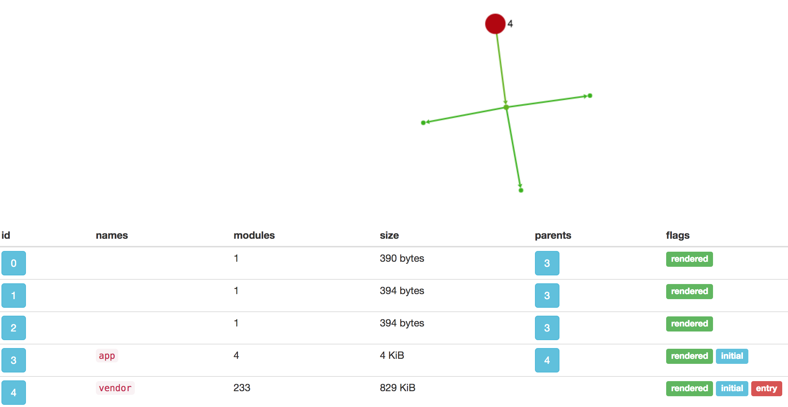
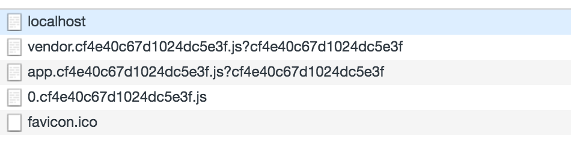
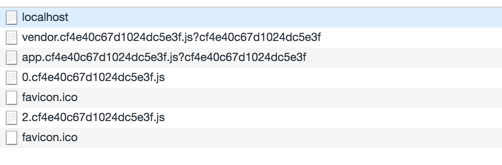

### 1.本章概述
对于大型的 web 应用来说，如果我们将所有的代码都放在一个文件中，然后一次性加载，这对于页面的性能来说可能存在问题，特别是当很多代码需要满足一定的条件才需要加载的情况下。webpack可以允许将我们的代码分割成为不同的 chunk，然后按需加载这些 chunk，这种特性就是我们常说的 code splitting。在本章节我会主要论述 Webpack 与 React-Router 一起实现按需加载的内容。其中包括如何针对开发环境和生产环境配置不同的 webpack.config.js 内容以及 webpack 按需加载的表现，通过本章节的学习你应该能够学会如何实现按需加载,以及如何使用该特性提升首页加载性能。好了，下面我们开始本章节的正文。

### 2.开发环境搭建
#### 2.1 配置webpack.config.js
我们配置如下的 webpack.config.js:
```js
//webpack.config.js
const webpack = require('webpack');
const HtmlWebpackPlugin = require('html-webpack-plugin');
const path = require('path');
module.exports = env => {
  const ifProd = plugin =>  env.prod ? plugin : undefined;
  const removeEmpty = array => array.filter(p => !!p);
  return {
    entry: {
      app: path.join(__dirname, '../src/'),
      vendor: ['react', 'react-dom', 'react-router'],
    },
    output: {
      filename: '[name].[hash].js',
      path: path.join(__dirname, '../build/'),
    },
    module: {
      loaders: [
        {
          test: /\.(js)$/, 
          exclude: /node_modules/, 
          loader: 'babel-loader', 
          query: {
            cacheDirectory: true,
          },
        },
      ],
    },
    plugins: removeEmpty([
      new webpack.optimize.CommonsChunkPlugin({
        name: 'vendor',
        minChunks: Infinity,
        filename: '[name].[hash].js',
      }),
      new HtmlWebpackPlugin({
        template: path.join(__dirname, '../src/index.html'),
        filename: 'index.html',
        inject: 'body',
        hash:true
      }),
      ifProd(new webpack.optimize.DedupePlugin()),
      ifProd(new webpack.optimize.UglifyJsPlugin({
        compress: {
          'screw_ie8': true,
          'warnings': false,
          'unused': true,
          'dead_code': true,
        },
        output: {
          comments: false,
        },
        sourceMap: false,
      })),
    ]),
  };
};
```
首先你应该关注如下的方法:
```js
const ifProd = plugin =>  env.prod ? plugin : undefined;
```
这个方法表示，只有在生产模式下才会添加特定的插件，如果不是在生产模式下，那么给插件就不需要添加，比如上面的 UglifyJsPlugin 插件压缩代码，在开发模式下是不需要的，只有在项目上线以后才需要将我们的 js/css 代码进行压缩。假如我们现在处于开发阶段，那么我们一般是需要启动 webpack-dev-server 的，我们看看如何对 webpack-dev-server进行配置:
```js
//webpack-dev-server.js
const webpack = require('webpack');
const WebpackDevServer = require('webpack-dev-server');
const webpackConfig = require('./webpack.config');
const path = require('path');
const env = {dev: process.env.NODE_ENV };
const devServerConfig = {
  contentBase: path.join(__dirname, '../build/'),
  historyApiFallback: { disableDotRule: true },
  stats: { colors: true }
};
const server = new WebpackDevServer(webpack(webpackConfig(env)), devServerConfig);
server.listen(3000, 'localhost');
```
注意：上面直接调用 webpack 方法会得到一个 Compiler 对象，我们的 webpack-dev-server 的很多功能，比如 HMR 都是基于这个对象来完成的，包括从内存中拿到资源来处理请求(参考 webpack-dev-server 的 lazyload 部分)。此时我们直接调用 listen 方法来完成 webpack-dev-server 的启动。

#### 2.2 配置package.json的script
通过配置 package.json 中的 script 部分，可以使得我们更加容易启动 cli 命令,比如我们配置的命令如下:
```js
 "scripts": {
    "start": "NODE_ENV=development node webpack/webpack-dev-server --env.dev",
    "build": "rm -rf build/* | NODE_ENV=production webpack --config webpack/webpack.config.js --progress --env.prod"
  },
```
此时我们可以通过下面简单的命令来替换复杂的webpack命令(参数很长):
```js
npm start
//或者npm run start
npm run build
//相当于rm -rf build/* | NODE_ENV=production webpack --config webpack/webpack.config.js --progress --env.prod
```
此时你应该注意到了，在特定的命令后面，比如 start 命令后面会有 env.dev ,而 build 后会存在 env.prod, 所以，我们可以在 webpack.config.js 中通过 *env* 对象判断当前所处的环境，从而在生产模式下添加特定的 webpack 插件，比如上面说的 UglifyJsPlugin 或者 DedupePlugin 等等。此时运行*npm start*就可以启动服务器，在浏览器中打开*http://localhost:3000*就可以看到当前的页面了。

#### 2.3 入口文件分析
在 Webpack 中一个重要的概念就是入口文件，通过入口文件我们可以构建前面章节所说的模块依赖图谱。我们看看上面的入口文件的内容:
```js
//src/index.js
import React from 'react';
import { render } from 'react-dom';
import Root from './root';
render(<Root />, document.getElementById('App'));
```
而 root.js 中的内容如下:
```js
import React from 'react';
import Router from 'react-router/lib/Router';
import browserHistory from 'react-router/lib/browserHistory';
import routes from './routes';
const Root = () => <Router history={browserHistory} routes={routes} />;
export default Root;
```
此时，在 Router 组件中的 routes 配置就是指的前端路由对象，而这也是 webpack 结合 react-router 实现按需加载的核心代码，我们看看他真实的代码结构:
```js
import Core from './components/Core';
function errorLoading(error) {
  throw new Error(`Dynamic page loading failed: ${error}`);
}
function loadRoute(cb) {
  return module => cb(null, module.default);
}
export default {
  path: '/',
  component: Core,
  indexRoute: {
    getComponent(location, cb) {
      System.import('./components/Home')
        .then(loadRoute(cb))
        .catch(errorLoading);
    },
  },
  childRoutes: [
    {
      path: 'about',
      getComponent(location, cb) {
        System.import('./components/About')
          .then(loadRoute(cb))
          .catch(errorLoading);
      },
    },
    {
      path: 'users',
      getComponent(location, cb) {
        System.import('./components/Users')
          .then(loadRoute(cb))
          .catch(errorLoading);
      },
    },
    {
      path: '*',
      getComponent(location, cb) {
        System.import('./components/Home')
          .then(loadRoute(cb))
          .catch(errorLoading);
      },
    },
  ],
};
```
注意：上面的例子使用的是 react-router 的对象配置方式，他的作用和下面的配置是一样的:
```js
<Route path="/" component={Core}>
    <IndexRoute component={Home}/>
   <Route path="about" component={About}/>
    <Route path="users" component={Users}>
    <Route path="*" component={Home}/>
 </Route>
```
其中，最重要的代码就是上面看到的 System.import，它和 require.ensure 方法是一样的，这部分内容在[webpack1](http://webpack.github.io/docs/code-splitting.html#es6-modules)中就已经引入了。比如上面的配置:
```js
  {
      path: 'users',
      getComponent(location, cb) {
        System.import('./components/Users')
          .then(loadRoute(cb))
          .catch(errorLoading);
      },
  }
```
表示如果路由满足*/users*的时候就会动态加载 components 下的 Users 组件，而且 Users 组件的内容是不会和入口文件打包在一起的，而是会单独打包到一个独立的 chunk 中的，只有这样才能实现按需加载的功能。而且针对上面的loadRoute方法也做一个说明:
```js
function loadRoute(cb) {
  return module => cb(null, module.default);
}
```
其中加载 *module.default* 是因为 ES6 的模块机制导致的，你可以查看导出的模块内容:
```js
//Users.js
import React from 'react';
const Users = () => <div>Users</div>;
export default Users;
```
其实是通过 *export default* 来完成的，如果引入了babel-plugin-add-module-export 就不需要这样处理了，你可以参考我写的[__esModule是什么?](https://github.com/liangklfangl/react-article-bucket/tree/master/es6/es6-QA)。如果要将上面的代码 users 路由修改为 require.ensure 加载，可以使用如下方式:
```js
<Route path="users" getComponent={(location, cb) => {
          require.ensure([], require => {
              cb(null, require('./components/Users').default)
          },'users');
        }} />
  </Route>
```
注意 require.ensure的签名如下:
```js
require.ensure(dependencies, callback, chunkName)
```
所以，我们通过第三个参数可以指定该 chunk 的名称，如果不指定该 chunk 的名称，你将获得下面的 0.xx, 1.xx这种 webpack 自动分配的 chunk 名称。

#### 2.4 依赖图谱分析
当你使用了 code splitting 特性，你可以使用很多工具来查看每一个 chunk 中都包含了什么特定的模块,比如我常用的这个[ webpack官方分析工具](https://github.com/webpack/analyse)。下面是我使用了这个工具查看本章节例子中的 stats.json 得到的依赖图谱。



通过这个图谱，你可以看到很多内容。比如其中的 entry 因为含有 webpack 的特定加载环境，所以需要在所有的 chunk 加载之前加载，这部分内容在前面章节也已经讲过; 而我们的 initial 部分表示在 webpack.config.js 中配置的入口文件。其他的 id 为0/1/2 的 chunk 就是动态产生的 chunk， 比如通过 System.import 或者 require.ensure 产生的动态的模块。 还有一点就是其中的 names 列，因为我们调用 require.ensure 的时候并没有指定当前的 chunk 的名称，即第三个参数，所以 names 就是为空数组。而且很多如 assets, modules, warnings, errors 等信息都可以在这个页面进行查看。此处不再赘述。当然，你也可以使用[第三方的工具](https://webpack.js.org/guides/code-splitting/#bundle-analysis)来查看我们的 stats.json 的内容。

### 3.按需加载的表现
当页面初始加载的时候你会看到下面的内容:



其中 vendor.js 应该很好理解，就是包含上面配置的框架代码:
```js
 vendor: ['react', 'react-dom', 'react-router'],
```
这部分如果你不理解，你可以回到前面章节进行复习。而 app.js 就是入口文件内容，即不包含动态加载的模块的内容。而另外一个 *0.xxxx*的 chunk 就是我们上面配置的:
```js
indexRoute: {
    getComponent(location, cb) {
      System.import('./components/Home')
        .then(loadRoute(cb))
        .catch(errorLoading);
    },
  }
```
因为 indexRoute 表示默认初始化的子组件。而当你访问*localhost:3000/about*的时候将会看到下面的内容:



其中 *2.xx* 的内容就是上面配置的*about*组件的内容:
```js
 {
      path: 'about',
      getComponent(location, cb) {
        System.import('./components/About')
          .then(loadRoute(cb))
          .catch(errorLoading);
      },
    }
```
而当你访问*localhost:3000/users*的时候将会看到下面的内容:


其中*1.xx*就是上面配置的如下内容:
```js
{
      path: 'users',
      getComponent(location, cb) {
        System.import('./components/Users')
          .then(loadRoute(cb))
          .catch(errorLoading);
      },
},
```
所以，按需加载的表现就是:当访问特定的路由的时候才会加载特定的模块，而不会将所有的代码一股脑的一次性全部加载进来。这对于优化首页加载的速度是很好的方案。同时，如果在上面你运行的是 *npm run start*,那么你在相应的目录下会看不到输出的文件，这是因为此时启动的是 webpack-dev-server，而 webpack-dev-server 会将输出的内容直接写出到内存中，而不是写到具体的文件系统中。但是如果你运行的是 *npm run build* 你会发现文件会写到文件系统中。我们看看在 webpack 中如何指定自己的输出结果到底是内存还是具体的文件系统:
```js
const MemoryFS = require("memory-fs");
const webpack = require("webpack");
const fs = new MemoryFS();
const compiler = webpack({ /* options*/ });
compiler.outputFileSystem = fs;
compiler.run((err, stats) => {
  // Read the output later:
  const content = fs.readFileSync("...");
});
```
通过这个 webpack 的官方实例你就会发现，其实只要我们指定了 compiler.outFileSystem 为 MemoryFS 实例，那么我们在 run/watch等方法中就可以通过相应的方法从内存中读取文件而不是文件系统了。这种方式在开发模式下还是很有用的，但是在生产模式下建议不要使用。

### 4.本章总结
通过本章节的学习，你应该对于 webpack+react-router 实现按需加载方案有了一个总体的认识。其实现的核心是通过 require.ensure 或者 System.import 来完成的。其中，本实例的完整代码你可以[点击这里查看](https://github.com/liangklfangl/webpack-code-splitting)。
